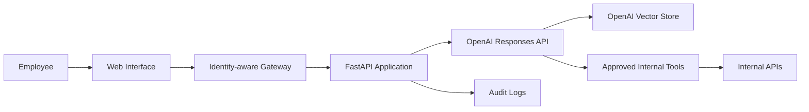

<div align="center">

# Corporate RAG Chatbot

### Secure enterprise knowledge assistant powered by OpenAI, FastAPI and approved internal tools


**Document retrieval · Source citations · Tool calling · Access control · Audit logging**

</div>

## Overview

Corporate RAG Chatbot is a portfolio-ready backend for an internal employee assistant. It combines Retrieval-Augmented Generation with approved business tools so employees can ask questions about policies, procedures, tickets and directory information through a single conversational interface.

The assistant is designed to answer from controlled company knowledge rather than relying only on general model knowledge. When supporting evidence is unavailable, it is instructed to say that it does not know instead of inventing an answer.

The project also demonstrates practical enterprise concerns such as authentication boundaries, server-side authorization, strict tool schemas, minimal audit logging, safe error handling and document sensitivity controls.

> **Project status:** backend foundation completed. A professional web interface is planned with Lovable and will consume the public API after deployment.

## Business problem

Internal knowledge is often spread across PDFs, FAQs, onboarding guides, support procedures and multiple business systems. Employees lose time searching for the correct document, while support teams repeatedly answer the same questions.

This project provides a controlled conversational layer that can:

- search approved internal documents;
- return grounded answers with source references;
- check live information through authorized tools;
- enforce role and department restrictions;
- reduce repetitive support requests;
- create an auditable foundation for an enterprise AI assistant.

## Architecture



### Request flow

1. The gateway authenticates the employee and injects trusted identity headers.
2. FastAPI validates the request and creates the user context.
3. The OpenAI Responses API searches approved documents through `file_search`.
4. When live information is required, the model can request an approved tool.
5. The server validates authorization and tool arguments before execution.
6. The final response returns the answer, sources and a safe tool-call summary.

## Main features

| Capability | Implementation |
|---|---|
| Corporate document search | OpenAI vector stores and `file_search` |
| Conversational API | FastAPI `/chat` endpoint |
| Source transparency | Retrieved file citations returned to the client |
| Approved actions | Strict function schemas and server-side dispatch |
| Identity context | User, role and department headers |
| Authorization | Tool-level permission checks |
| Ingestion pipeline | Document registry and batch upload script |
| Auditability | Metadata-focused JSONL audit logging |
| Reliability | Health and readiness endpoints |
| Safety | Controlled errors without secret or trace exposure |

## Technology stack

- **Python 3.11+**
- **FastAPI** and Uvicorn
- **OpenAI Responses API**
- **OpenAI vector stores and file search**
- **Pydantic** for configuration and validation
- **Pytest** for automated tests
- **Docker** for reproducible deployment
- **GitHub Actions** for continuous integration
- **Lovable** for the planned web interface

## Repository structure

```text
corporate-rag-chatbot/
├── app/
│   ├── api/                 # Routes and request lifecycle
│   ├── core/                # Configuration, auth, errors and audit logs
│   ├── schemas/             # Public request and response models
│   ├── services/            # RAG workflow and OpenAI integration
│   └── tools/               # Tool schemas, validation and dispatch
├── docs/
│   ├── agents-sdk-adaptation.md
│   ├── deployment.md
│   ├── frontend-integration.md
│   └── security.md
├── scripts/
│   └── ingest_documents.py
├── tests/
│   ├── test_rag_service.py
│   └── test_tools.py
├── .env.example
├── .github/workflows/ci.yml
├── Dockerfile
├── LICENSE
├── pyproject.toml
└── README.md
```

## Quick start

Clone the repository and enter the project directory:

```bash
git clone https://github.com/cmosantos/corporate-rag-chatbot.git
cd corporate-rag-chatbot
```

Create and activate a virtual environment on Windows:

```powershell
python -m venv .venv
.\.venv\Scripts\Activate.ps1
```

Install the project with development dependencies:

```powershell
pip install -e ".[dev]"
```

Create the local environment file:

```powershell
Copy-Item .env.example .env
```

Start the API:

```powershell
uvicorn app.main:app --reload
```

Open the interactive API documentation at:

```text
http://127.0.0.1:8000/docs
```

## Environment variables

| Variable | Purpose |
|---|---|
| `OPENAI_API_KEY` | Server-side OpenAI API credential |
| `OPENAI_MODEL` | Model used by the Responses API |
| `OPENAI_VECTOR_STORE_ID` | Vector store containing approved documents |
| `APP_ENV` | Application environment |
| `INTERNAL_API_BASE_URL` | Base URL for approved internal services |
| `INTERNAL_API_TOKEN` | Server-side service credential |
| `AUTH_SHARED_SECRET` | Local development authentication placeholder |
| `AUDIT_LOG_PATH` | JSONL audit log destination |
| `MAX_TOOL_ROUNDS` | Maximum tool execution cycles per request |
| `ALLOWED_SENSITIVITY_LEVELS` | Document sensitivity ingestion allowlist |

Never commit the real `.env` file or production secrets.

## API usage

### Health check

```http
GET /healthz
```

### Readiness check

```http
GET /readyz
```

### Chat request

```http
POST /chat
Content-Type: application/json
X-User-Id: employee-123
X-User-Roles: employee,it_support
X-Department: operations
```

```json
{
  "question": "What is the status of ticket TCK-12345?",
  "conversation_id": "demo-conversation"
}
```

The response can include the generated answer, retrieved sources and a summary of authorized tool calls.

## Document ingestion

Prepare a registry file describing each approved document:

```json
[
  {
    "path": "documents/internal-faq.pdf",
    "title": "Internal FAQ",
    "owner": "Knowledge Team",
    "source_url": "https://intranet.example.invalid/faq",
    "sensitivity": "internal",
    "freshness_date": "2026-06-01"
  }
]
```

Run the ingestion script:

```powershell
python scripts/ingest_documents.py --registry registry.json --vector-store-name internal-knowledge
```

Copy the generated vector store ID into `OPENAI_VECTOR_STORE_ID` before starting the API.

## Run the tests

```powershell
pytest -q
```

The tests mock OpenAI and internal API behavior, so they do not require external network access.

## Run with Docker

Build the image:

```powershell
docker build -t corporate-rag-chatbot .
```

Run the container using the local environment file:

```powershell
docker run --env-file .env -p 8000:8000 corporate-rag-chatbot
```

## Security principles

This project treats RAG as an enterprise application rather than a simple chat interface.

- Source documents and credentials remain on the server.
- Client-provided identity headers must not be trusted in production.
- A corporate gateway should authenticate employees and replace identity headers.
- Every tool call is validated again before execution.
- Authorization is enforced by the backend, not by the model.
- Audit logs avoid storing full prompts, retrieved chunks and secrets by default.
- Unsupported sensitivity levels are rejected during ingestion.
- Public deployment should include rate limiting, secret management and monitoring.

See [Security Notes](docs/security.md) and [Deployment Notes](docs/deployment.md) for more details.

## Frontend plan

The Lovable interface will provide a clean corporate chat experience with:

- responsive desktop and mobile layouts;
- suggested employee questions;
- answer cards with document citations;
- visible loading and error states;
- a demo mode for portfolio presentation;
- an environment-based API URL without exposing server credentials.

See [Frontend Integration](docs/frontend-integration.md).

## Roadmap

- [x] Build the FastAPI backend
- [x] Integrate the OpenAI Responses API
- [x] Add document ingestion and file search
- [x] Implement approved internal tools
- [x] Add authorization and audit foundations
- [x] Add automated tests
- [x] Add Docker and continuous integration
- [ ] Deploy the backend to a managed cloud service
- [ ] Publish the Lovable frontend
- [ ] Add enterprise identity provider integration
- [ ] Add evaluation datasets and quality metrics
- [ ] Add production observability and cost dashboards

## Portfolio value

This repository demonstrates hands-on knowledge of generative AI integration, RAG architecture, API development, Python, secure tool calling, document governance, authentication boundaries, automated testing, containerization and technical documentation.

It is designed as a realistic foundation for an internal support or knowledge-management assistant rather than only a visual chatbot demonstration.

## Author

**Claudio Santos**  
IT Support Professional focused on Microsoft 365, cloud computing, AI agents and workflow automation.

[](https://github.com/cmosantos)

## License

Distributed under the MIT License. See [LICENSE](LICENSE) for details.
